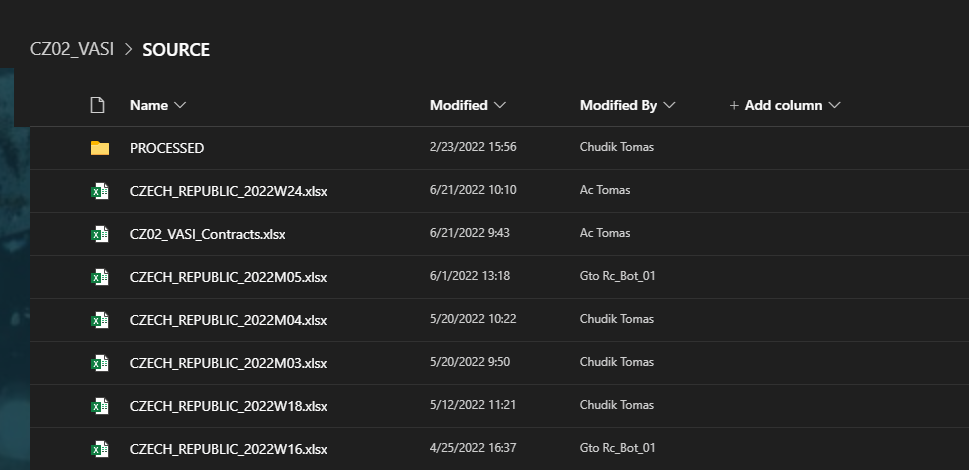

## Project CZ02_VASI

### There are 3 scripts in this project
| Script | Description
|---|---|
| Script A | Input data validation + upload to sharepoint |
| Script B | Data transormation based on configuration (.CSV creation) |
| Script C | Upload of .CSV to SAP (SM35). Verification and logging |
 
  
 ----------------------------------------------------------------------------
#### Workflow
 
 <picture>
  
</picture>

1) Periodic weekly and monthly reports (xlsx) sent via email. Placed in the sharepoint library by flow

<picture>
  
  
</picture>
- Workflow
1. MS Flow
  2. Script A
    3. Powerapps
      4. Script B
        5. Script C
1. Flow receives weekly/monthly report (.xlsx) files and places them in the sharepoint library
2. Script A searches through SP library and processes every file it discovers within this SP library. 
    Fileas are then moved to processed subdirectory.
    Processed data is uploaded to sharepoint list which servers as data source for powerapps
    
3. Powerapps is the frontend for users. User makes final decision in the powerapps. Individual 
    list item is marked 'Ready' for further processing
    
4. Script B periodically scans SP list for items marked 'Ready'. It produces output CSV files 
    which are placed in yet another SP library waiting for Script C
    Output file name is structured so that uploading Script C can perform apropriate action
    
5. Script C takes outpu .CSV files from the SP library and uploads them to SAP based on rules
    specified within configuration and encoded within file name
