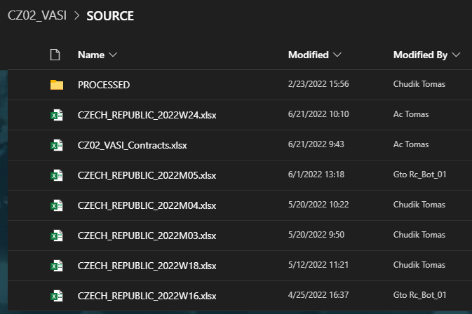
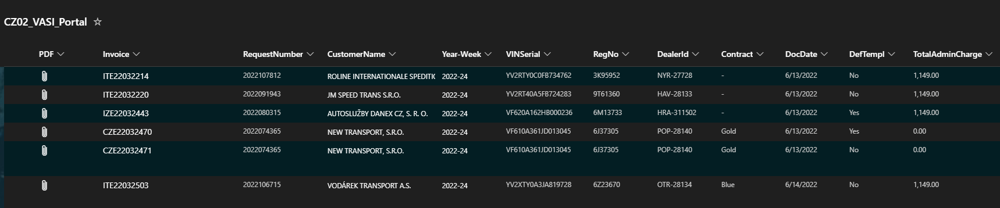

## Project CZ02_VASI
Series of scripts for determining the contract coverage and presenting data in consistent way to the sharepoint users.<br>
In this project we also make use of powerapps as a frontend to the users.<br>
Based on user final decision, data is further processed and script(s) finish by uploading .CSV file(s) to SAP

### There are 3 scripts in this project
| Script | Name | Description |
|---|---|---|
| Script A | ProcessInputAndUploadToSPList | Input data validation + upload to sharepoint |
| Script B | ProcessSPListAndMakeCSV | Data transormation based on configuration (.CSV creation) |
| Script C | UploadToSAP | Upload of .CSV to SAP (SM35). Verification and logging of task result |
 
  
 ---
 ### Workflow
 <picture>
  
</picture>


### 1. Periodic weekly and monthly reports (.xlsx) arrive by e-mail
Placed by MS flow to the sharepoint source library for script A to discover and process

<picture>
  
</picture>


### 2. Script A processes incoming reports
All monthly and weekly reports discovered by Script A in the SOURCE library are processed<br>
Some data transormation occurs at this stage, mainly the contract coverage determination plus<br>
some additional data clensing in order to make data more consistent over time since reports<br>
arriving sometimes differ in presentation quality<br><br>
Finally data is placed in the sharepoint list which is a datasource for frontend (powerapss) app<br>
that presents data to users


<picture>
  
</picture>
<br>


### 3. CZ02_VASI_Portal sharepoint list now contains items
This list is a datasource for powerapps app. Each item is marked 'Ready' in the designated column.<br>
Such item is then processed by the Script B

### 4. Script B processes 'Ready' items
Script B produces output .csv file based on rules defined within configuration

<details><summary>Configuration</summary>
<p>

#### 

```xml
<?xml version="1.0" encoding="UTF-8"?>
<Config>
 <Country name="CZ">
   <WorkingDirectory>C:\!AUTO\CZ02_VASI\</WorkingDirectory>
   <CredentialsFile>C:\!AUTO\CREDENTIALS\logins.txt</CredentialsFile>
   <CompanyCode>CZ02</CompanyCode>
   <VendorParma>4645</VendorParma>
   <TradingPartner>BE06</TradingPartner>
   <PaymentTerms>C020</PaymentTerms>
   <Currency>CZK</Currency>
   <Admin>tomas.chudik@volvo.com</Admin>
   <AdminChargeSeparate>False</AdminChargeSeparate>
   <DealerIdMatrix>
	<VTC-24270 CC="5453000190" PC="3009001" />
	<NYR-27728 CC="5453000290" PC="3009002" />
	<BRN-28129 CC="5453000390" PC="3009003" />
	<HRA-28130 CC="5453000490" PC="3009004" />
	<UST-28131 CC="5453000590" PC="3009005" />
	<CBU-28132 CC="5453000690" PC="3009006" />
	<HAV-28133 CC="5453000790" PC="3009007" />
	<OTR-28134 CC="5453000890" PC="3009008" />
	<LOD-28135 CC="5453000990" PC="3009009" />
	<HUM-28136 CC="5453001090" PC="3009010" />
	<OLO-28137 CC="5453001190" PC="3009011" />
	<TUR-28138 CC="5453001290" PC="3009012" />
	<POP-28140 CC="5453001590" PC="3009015" />
	<STR-28142 CC="5453001690" PC="3009016" />
	<KLE-28143 CC="5453001790" PC="3009017" />
	<NYR-311625 CC="5453000290" PC="3009502" />
	<HRA-311502 CC="5453000490" PC="3009504" />
	<UST-311594 CC="5453000590" PC="3009505" />
	<CBU-312765 CC="5453000690" PC="3009506" />
	<OTR-311992 CC="5453000890" PC="3009508" />
	<LOD-312691 CC="5453000990" PC="3009509" />
	<HUM-310735 CC="5453001090" PC="3009510" />
	<OLO-311414 CC="5453001190" PC="3009511" />
	<TUR-312218 CC="5453001290" PC="3009512" />
	<RTC-306520 CC="5453001390" PC="3109513" />
	<OST-313417 CC="5453001490" PC="3109514" />
	<POP-313492 CC="5453001590" PC="3009515" />
	<STR-320059 CC="5453001690" PC="3009516" />
	<KLE-321708 CC="5453001790" PC="3009517" />
   </DealerIdMatrix>

   <CaseCCP>
     <DealerIdCC>True</DealerIdCC>
     <TaxAmount>0,00</TaxAmount>
     <TaxCode>JM</TaxCode>
     <GL>799705</GL>
     <CC>5451210100</CC>
     <PC></PC>
   </CaseCCP>

   <CaseOUT>
     <AdminCharge>
        <LineText>VAS1-AdminCharge</LineText>
	<TaxCode>JM</TaxCode>
        <GL>298606</GL>
        <CC></CC>
        <PC>2001401</PC>
     </AdminCharge>
     <VAS1>
	<LineText>VAS1-Recharge</LineText>
     	<TaxCode1>JM</TaxCode1>
	<TaxCode2>JP</TaxCode2>
        <GL>298606</GL>
        <CC></CC>
        <PC>2001401</PC>
     </VAS1>
     <VAS2>
        <DealerIdPC>True</DealerIdPC>
	<LineText>VAS2-SC_Coverage</LineText>
	<GL>298602</GL>
        <TaxCode1>JM</TaxCode1>
	<TaxCode2>JP</TaxCode2>
     </VAS2>
   </CaseOUT>
 </Country>	
</Config>

```
</p>
</details>

Output file is placed in the sharepoint library.<br> 

<br>

### 5. Script C processes files with Upload status 'No'
